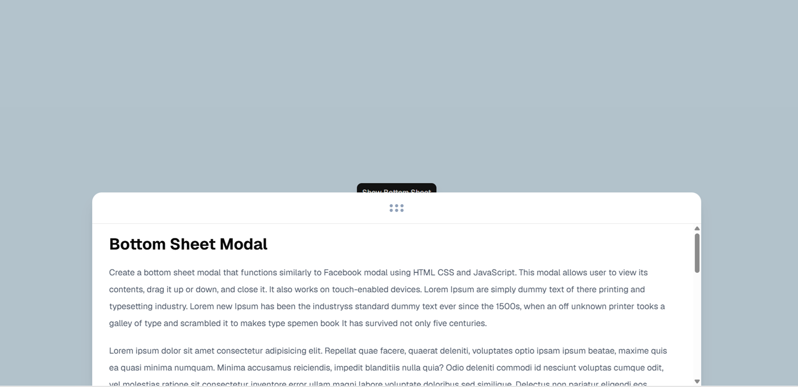

# 📱 Bottom Sheet

A simple **Bottom Sheet** component built using **React**, **Vite**, **Tailwind CSS**, and **shadcn/ui**. The bottom sheet smoothly slides up from the bottom of the screen and provides a modern mobile-friendly user experience.

---

## 📸 Screenshot

Add your project screenshot inside the **public** folder.




---

## ✨ Features

* 📱 Smooth bottom sheet animation
* 🎨 Modern UI
* 📲 Mobile-friendly design
* 💨 Responsive layout
* ❌ Open and close functionality

---

## 🛠️ Tech Stack

* React
* Vite
* Tailwind CSS
* shadcn/ui
* Lucide React

---

## 🚀 Getting Started

Clone the repository

```bash
git clone https://github.com/your-username/bottom_sheet.git
```

Go to the project folder

```bash
cd bottom_sheet
```

Install dependencies

```bash
npm install
```

Run the development server

```bash
npm run dev
```

---

## 📦 Build

```bash
npm run build
```

---

## 👩‍💻 Author

**Srushti Malod**
